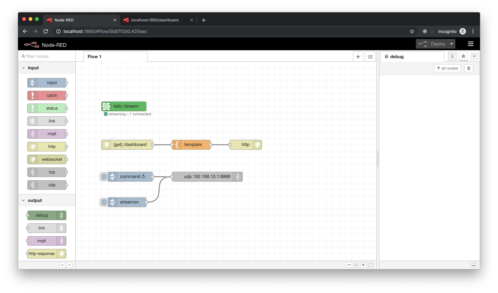
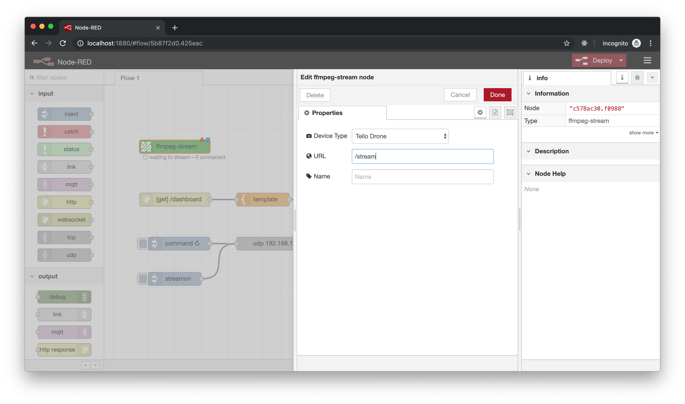

# node-red-contrib-ffmpeg
[](https://npmjs.org/package/node-red-contrib-ffmpeg)
[](https://npmjs.org/package/node-red-contrib-ffmpeg)

A simple ffmpeg wrapper for streaming video from a [DJI Tello Drone](https://www.ryzerobotics.com/tello) or a [Raspberry Pi](https://www.raspberrypi.org/).



## Installation
```
$ npm install node-red-contrib-ffmpeg
```

> **Note:** This node requires that you have [ffmpeg](https://ffmpeg.org/) installed on your machine. Homebrew users `brew install ffmpeg`.

## Configure your node
Open the node's configuration panel to set Device Type (Tello Drone or Raspberry Pi) and the stream url.

> **Note:** In this example our stream will be accessible at `ws://<host>:<port>/stream`

## Device specific instructions
There are a few minor hardware specific steps depending on your device.

### Tello Drone
Before you can use your Tello Drone you **MUST** activate it in the official Tello Drone app.
Once your drone is activated, you can connect to it's WiFi Network `TELLO-XXXXXX` and send it commands via UDP.

In the example flow, to start the video stream, click the `command` command followed by `streamon` command.

### Raspberry Pi
Before you can stream with a Raspberry Pi, you will need to attach a camera and enable it.

To enable camera support, run the following command:
```
sudo raspi-config
```

Then use the arrow keys to choose _Interfacing Options_ > _Camera_ and select to enable the camera. Once the camera is enabled, reboot your Raspberry Pi.

> **Note:** For most up-to-date instructions for Raspberry Pi Camera setup, check out the [official documentation](https://www.raspberrypi.org/documentation/configuration/camera.md).

The Raspberry Pi will start streaming as soon as you start node red.

## Authors
- [Nicholas Bourdakos](https://github.com/bourdakos1)
- [Pooja Mistry ](https://github.com/pmmistry)
